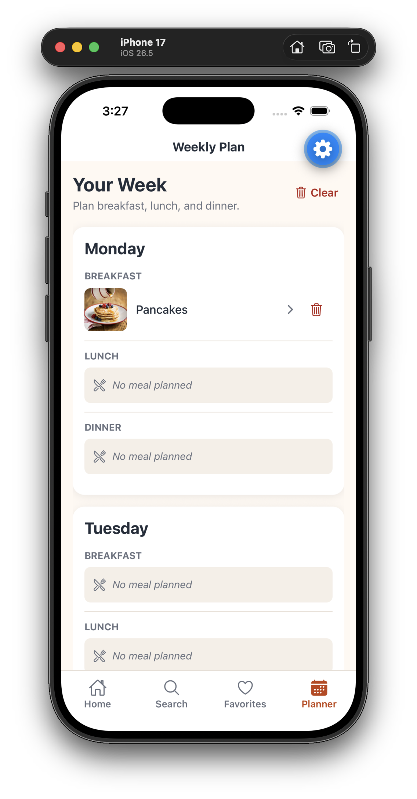

# Recipe & Meal Planner

A React Native meal-planning application built with Expo and TypeScript. Users can discover recipes, view cooking instructions, save favorites, and organize breakfast, lunch, and dinner for each day of the week.

This portfolio project demonstrates mobile development, REST API integration, typed navigation, shared state management, local persistence, reusable component design, and asynchronous UI handling.

### Screenshots

| Home | Meal Details | Weekly Planner |
  |
  
  |

Additional screenshots in: docs/screenshots

## Features

- Search for recipes by meal name
- Browse meals by category
- View ingredients, measurements, and cooking instructions
- Save and remove favorite meals
- Plan breakfast, lunch, and dinner for each day
- Replace or remove planned meals
- View today’s meals from the Home screen
- Saves favorites and meal plan list locally
- Handle loading, empty, and error states
- Navigation with bottom tabs and native stack navigation

## Technology

- React Native
- Expo
- TypeScript
- React Navigation
- AsyncStorage
- TheMealDB API
- Expo Vector Icons

## Technical Highlights

- Separates screens, feature logic, data access, and persistence
- Uses custom hooks to manage asynchronous and feature state
- Uses Context to share favorites and meal-plan state
- Normalizes TheMealDB ingredient data into reusable application models
- Persists favorites and weekly plans locally with AsyncStorage
- Combines bottom-tab navigation with native stack navigation
- Uses reusable components and a centralized visual theme

## Architecture

The application follows a layered architecture that separates presentation, feature logic, shared state, data access, and persistence.

See docs/diagrams/SystemArchitecture.drawio.svg for diagram explanation.

```text
Screens and components
        ↓
Custom hooks and contexts
        ↓
API and storage services
        ↓
TheMealDB API and AsyncStorage
```

Screens and components render the interface and respond to user interaction.

Custom hooks manage feature logic, asynchronous requests, loading states, and errors.

Contexts provide shared favorites and meal-plan state across the application.

API services request recipe data and transform external responses into application models.

Storage services save and restore favorites and meal plans with AsyncStorage.

This separation of responsibilities keeps the interface focused on presentation while moving business logic and data operations into dedicated modules.

See docs for detailed data-flow explanations and diagrams.

See docs/diagrams/SystemArchitecture.drawio.svg for diagram explanation.

## Project Structure

```text
src/
├── api/          # TheMealDB requests and data transformation
├── components/   # Reusable interface components
├── context/      # Shared favorites and meal-plan state
├── hooks/        # Feature logic and asynchronous state
├── models/       # TypeScript data models
├── navigation/   # Stack and bottom-tab navigation
├── screens/      # Application screens
├── storage/      # AsyncStorage services
├── theme/        # Shared colors, spacing, and typography
└── utils/        # General utility functions
```

## Getting Started

### Prerequisites

Install the following:

- Node.js
- npm
- Expo Go or a compatible simulator
- Xcode for the iOS Simulator
- Android Studio for the Android Emulator

### Installation

Clone the repository:

```bash
git clone https://github.com/Tylen32/react-native-recipe-and-meal-planner.git
cd react-native-recipe-and-meal-planner
```

Install the dependencies:

```bash
npm install
```

Start the application:

```bash
npx expo start
```

From the Expo terminal:

- Press `i` to open the iOS Simulator
- Press `a` to open the Android Emulator
- Scan the QR code with Expo Go when supported

## Known Limitations

- Favorites and meal plans are stored only on the current device.
- The application does not include accounts or cloud synchronization.
- Removing the application may remove locally stored data.
- TheMealDB does not provide reliable calorie or macronutrient information.
- Recipe availability and completeness depend on TheMealDB data.

## Future Improvements

- Add automated tests for API transformations and storage
- Add ingredient-based search
- Add serving-size adjustments
- Improve offline behavior
- Expand accessibility testing
- Add optional accounts and cloud synchronization

## API Attribution

Recipe information and meal artwork are provided by [TheMealDB](https://www.themealdb.com/).

The application uses TheMealDB’s development API for educational and portfolio purposes.

## Documentation

- [Architecture](docs/architecture.md)
- [Design decisions](docs/design-decisions.md)
- [Testing](docs/testing.md)

## License

See [LICENSE](LICENSE) for license information.